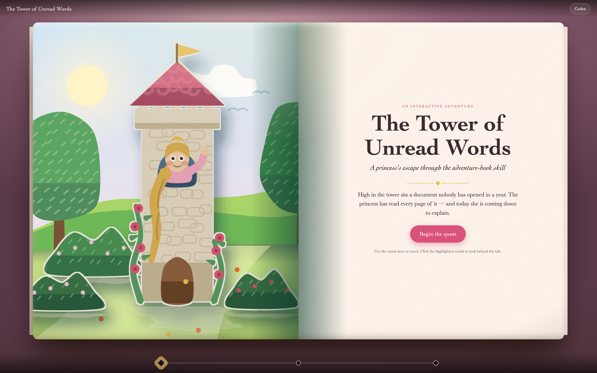

# Adventure Book — a Claude Code skill

Turn any Markdown document into a self-contained interactive HTML **adventure book**.



<sup>A cover in a custom theme extending `knight`. Every scene is generated SVG: paper-cut flats standing on the page, with the words printed on the facing leaf.</sup>

A README, onboarding guide, AGENTS.md, ADR, spec, runbook, tutorial, postmortem — or a plain
old story — becomes a themed journey the reader travels stage by stage. Every page is an open
pop-up book spread: storybook paper-cut art standing on the left leaf, the words printed on the
right, a progress map, keyboard navigation, and glowing words that pop out to reveal the *real*
thing behind the allegory (the actual command, rule, decision or number from the source document).

Output is **one `.html` file** that works offline: no build step for the reader, no network
requests, no dependencies.

The book is written short and shaped as a story — one protagonist who owns the problem, the
document's argument as the plot, stages that follow from one another, the document's own
warned-about mistake before the end, and a payoff the hero earns — because a wall of themed
prose teaches nothing. Narrative runs 60–120 words per stage; the detail lives in the pop-outs
and the original document, one click away. Claude asks for the source document and the theme
if you don't give them.

Built-in themes: `knight`, `space`, `pirate`, `noir`, `expedition`, `deepsea`, `storybook` — or
describe your own and Claude will extend a preset.

## Install

### With the `skills` CLI (recommended)

```bash
npx skills add github.com/dworzycp/ai-adventure-book-skill
```

This installs into the current project by default. Add `-g` to install it globally, for every
project on the machine:

```bash
npx skills add github.com/dworzycp/ai-adventure-book-skill -g
```

To update it later:

```bash
npx skills update
```

### By hand

The repository *is* the skill, so a plain clone into a skills directory works too.

**Personal skill (available in every project):**

```bash
git clone https://github.com/dworzycp/ai-adventure-book-skill.git ~/.claude/skills/adventure-book
```

**Project skill (checked in, available to everyone on the repo):**

```bash
git clone https://github.com/dworzycp/ai-adventure-book-skill.git .claude/skills/adventure-book
```

The directory name matters here: it must be `adventure-book`, matching the `name` in `SKILL.md`.
Update a hand-installed copy with `git -C ~/.claude/skills/adventure-book pull`.

### Check it loaded

Restart Claude Code (or start a new session) and type:

```
/adventure-book
```

### Requirements

- [Claude Code](https://claude.com/claude-code)
- Python 3.9+ for the build script — standard library only, nothing to `pip install`
- Node.js if you install with `npx` (the `skills` CLI); not needed for the manual route

## Use it

Just ask, in your own words:

> Turn `docs/onboarding.md` into an interactive adventure book. Theme: a pirate voyage.
> Save it as `onboarding-voyage.html`.

Claude reads the source document, maps each real concept to a themed counterpart, writes the
stages, draws the scenes, and builds the file. Then open it in any browser.

You don't have to say "adventure book" — the skill also triggers on asks like "make this doc
fun", "gamify our runbook", or "turn this postmortem into something the team will click through".

Inside a finished book: **arrow keys** move between stages, the **map** at the bottom jumps
anywhere, **glowing words** open pop-outs, the **codex** button lists every pop-out, and the
**original scroll** button unrolls the verbatim section of the source document behind the stage.

## What's in here

| Path | What it is |
| --- | --- |
| `SKILL.md` | The skill itself: workflow, content formats, and the writing rules Claude follows |
| `assets/template.html` | The engine — navigation, pop-out drawer, codex, map, parallax, mobile and reduced-motion support |
| `assets/themes.json` | Theme presets (colors, fonts, vocabulary) |
| `scripts/build_book.py` | Assembles `book.json` + stage Markdown + SVG scenes into the final HTML |
| `scripts/scene_engine.py` | Renders the scenes: layered paper-cut flats with card edges and shadows, storybook characters, subtle motion |
| `references/story.md` | How a document becomes a short story: its one argument, a protagonist who owns the problem, story shape by document type, the fact ledger, the spine |
| `references/themes.md` | Voice, motifs and stage-naming patterns per theme |
| `references/scenes.md` | The art direction and the scene engine's manual |
| `evals/` | Eval suite for [skill-creator](https://github.com/anthropics/skills), plus sample source docs |

## Building a book by hand

You don't need Claude to run the builder. Create a working folder:

```
work/
  book.json
  stages/01-gates.md
  draw.py            # optional: renders scenes/*.svg with scripts/scene_engine.py
  scenes/01-gates.svg
```

Scenes are plain inline SVG, so you can hand-write them or generate them; `references/scenes.md`
documents the engine. A stage without a `scene:` gets a generated backdrop in the same style.

`book.json` (paths relative to the JSON file):

```json
{
  "title": "The Quest for the Portal",
  "subtitle": "A knight's journey through AGENTS.md",
  "theme": "knight",
  "source": "../AGENTS.md",
  "cover":  { "eyebrow": "An interactive adventure", "scene": "scenes/cover.svg", "blurb": "cover.md" },
  "stages": [ "stages/01-gates.md" ],
  "ending": { "scene": "scenes/ending.svg", "blurb": "ending.md",
              "recap": [ "Cross the [[Veil|vpn]] before anything else" ] }
}
```

A stage is a Markdown file with frontmatter and its pop-outs inline:

```markdown
---
id: gates
title: The Gates of the Keep
chapter: Chapter I
source: Local Development Setup
scene: scenes/01-gates.svg
---
Mist clings to the road as you approach the keep. A guard bars the way: none may
enter who have not passed through [[the Veil|vpn]]...

## popout: vpn
title: VPN
source: Local Development Setup
You have to be on the company VPN before anything else works — the internal package
registry is only reachable from inside the network.
```

A pop-out's `source:` must sit in its header lines, directly under `## popout: id`, not after
the explanation.

Then build:

```bash
python3 scripts/build_book.py --content work/book.json --out quest.html
```

The builder warns about pop-out ids with no matching block, `source:` headings it can't find in
the document, stages that are too thin *or too long*, over-long pop-out explanations, stages
that mark too many pop-outs, and source sections nothing in the book refers to. It also reports
the total narrative word count, so bloat is visible in the build output.

## License

MIT — see [LICENSE](LICENSE).
